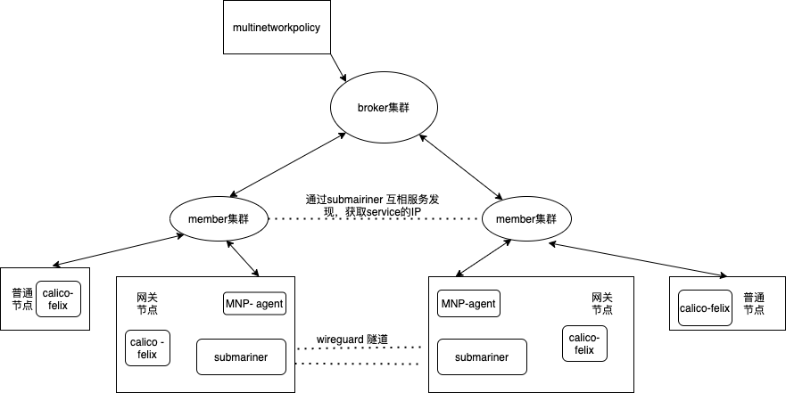

# 跨集群NetworkPolicy

## 目标

在目前的submariner等多集群的网络打通中，目前实现都是全量的打通，部署在多个集群的不同的命名空间的服务都可以互相访问。 而在kubernetes多租户的场景中，一般以namespace为单位，需要实现不同的namespace的pod不能互相访问。

所以为了实现kubernetes网络多租户隔离，我们需要在多集群网络打通的基础上，补足不同的namespace不能互相访问的功能。


## 实现

在单集群中，我们通常使用iptables规则实现pod到pod流量的管控，并不直接管理到pod是否可以访问service VIP，这是由于networkpolicy的iptables规则通常作用在filter的forward 链中，在pod访问service VIP时，iptables规则判断走到forward链中，已经使用在prerouting的NAT表通过kube-proxy设置的iptable规则，通过DNAT转变为了pod IP地址。

但是在多集群中，例如A集群的pod访问B集群的service，service的DNAT 为pod的IP地址在B集群中完成，因此我们可以在A集群的网关节点在报问进入wireguard隧道之前，使用iptables规则判断，是否应该放行该数据报文。


可以使用iptables规则的设置来限制对多集群服务的访问。


#### 实现过程

默认都拒绝，设置哪些可以通。

```yaml
apiVersion: 
kind: MultiNetworkPolicy
metadata:
  name: test-network-policy
  namespace: default
spec:
  podSelector:
    matchLabels:
      role: db
  egress： 
    allow:
    - namespaceSeletor：
        matchLabels: 
          role: kjl
    - serviceSelector:
        matchLabels:
          role: db
     ports： // 允许流出的端口
     - protocol: TCP
       port: 5978
```


由于跨集群的流量都通过网关节点，所以可以只在网关节点设置。

需要在gateway起一个agent，apply iptables  和ipset。


### 架构



通过submariner打通多集群之间服务互访的网络IP段。


在本集群不同namespace的pod的隔离，这个流量的iptables规则的设置交给本集群的cni插件进行管理，比如calico的felix组件。会根据networkpolicy设置iptables规则进行设置。


管理多集群的不同namespace的service访问的iptables规则，交给MNP-agent进行管理，MNP-agent根据multinetworkpolicy的设置，决定选定的pod可以对哪些服务进行访问。


通过iptables规则限制多集群服务访问的需要能获取联邦集群中的服务的虚拟IP地址，考虑结合submariner的服务发现机制，在联邦集群之间同步服务的IP地址。


在多个集群中，起一个监听service的agent，当监听到service变更的时候，生成相应的serviceexport，submairiner的服务发现组件，会生成一个serviceimport cr到broker集群，在成员集群中都会监听serviceimport集群的变更，同步到成员集群中。


##### multinetworkpolicy流程

1. 在broker部署multinetworkpolicy

2. mnp-agent监听到member的multinetworkpolicy的变更，结合集群内的serviceimport资源中的信息，我们需要筛选选定的pod可以访问哪些服务IP。

3. 由于本集群的pod的流量交给cni插件进行管理，为了networkpolicy和multinetowrkpolicy不冲突，我们指定pod访问service IP段的时候才跳入MNP-agent设置的链。

   所以mnp-agent需要监听到endpoints的变更，获取各个endpoints的拉通的subnet的集合，更新mnp-agent需要拦截的多集群的网络流量的ipset 的IP值。


##### iptables 设置规则

```shell
-N mnp-FORWARD
-I FORWARD -m comment --comment "mnp:" -j  mnp-FORWARD
-A mnp-FORWARD -m set --match-set {选定的podIP的集合} src -m set --match-set  {各个集群的service网段集合} dst  -j mnp-fw-{multinetworkpolicy1 的名称的hash值h}
-A mnp-FORWARD -m set --match-set {选定的podIP的集合} src -m set --match-set  {各个集群的service网段集合} dst -j mnp-fw-{multinetworkpolicy2 的名称的hash值}
-A mnp-fw-{multinetworkpolicy1 的名称的hash值} -m set --match-set mnp-service-(multinetworkpolicy 名称的hash值) dst  -j MARK --set-xmark 0x100000/0x100000
-A mnp-fw-{multinetworkpolicy1 的名称的hash值} -m comment --comment "Drop if no policy match" -j DROP
-A FORWARD -m comment --comment "" -m comment --comment "multicluster Policy explicitly accepted packet." -m mark --mark 0x100000/0x100000 -j ACCEPT

```

